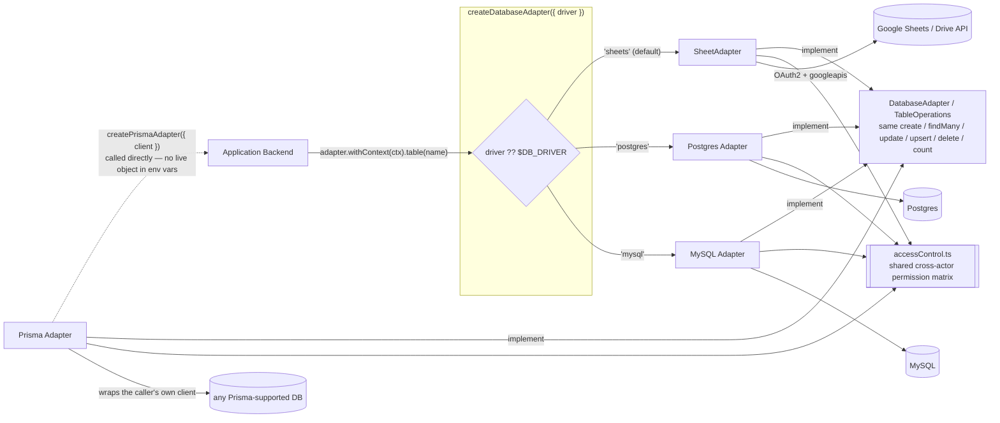
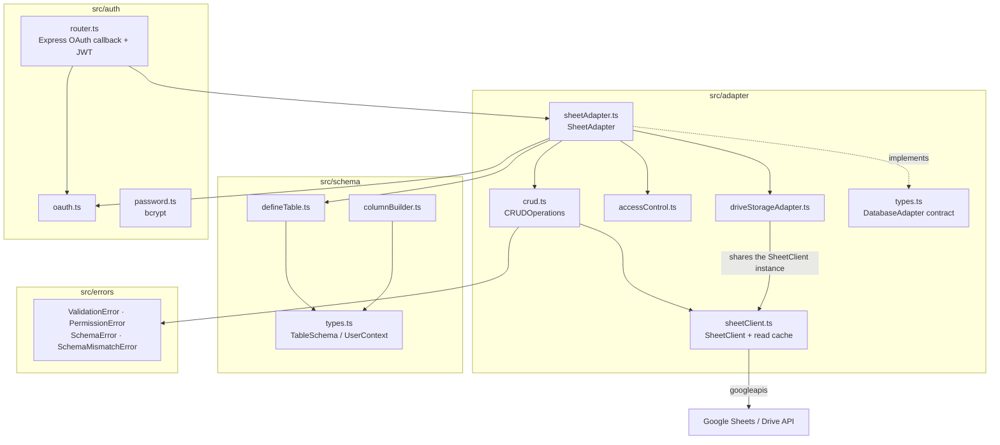
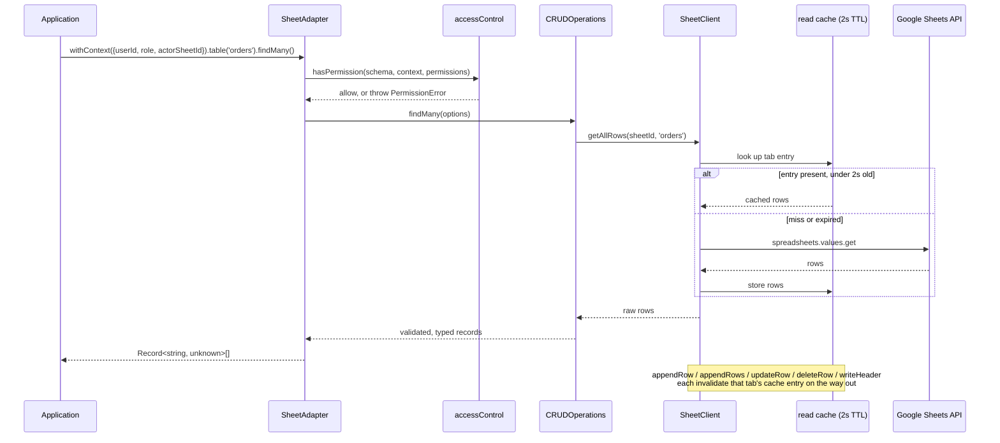
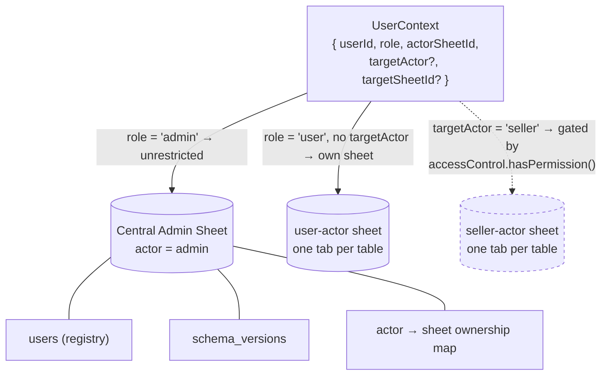
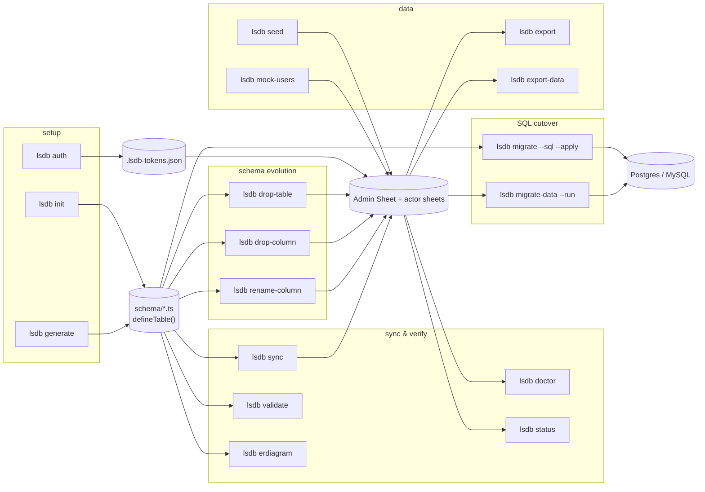

# lsdb Architecture

`lsdb` is a schema-first, actor-aware `DatabaseAdapter`. The same `adapter.withContext(ctx).table(name).create(...)` call works whether the engine underneath is Google Sheets, Postgres, MySQL, or a caller-supplied Prisma client — the Sheets engine additionally layers OAuth, an actor-based sheet-per-tenant storage model, and a read cache on top of the shared `TableOperations` contract.

Five views, each isolating one part of the mechanism:

1. Engine selection and the shared contract
2. Sheets-engine module map
3. A `findMany()` call end-to-end, including the read cache
4. The actor storage model and cross-actor access
5. The CLI's own dependency surface

---

## 1. Engine Selection & the Shared Contract

`createDatabaseAdapter({ driver })` (or `$DB_DRIVER`) is the only branch point in application code. Every engine below it implements the identical `DatabaseAdapter` / `TableOperations` interface and delegates cross-actor permission checks to the same `accessControl.ts` — that's what lets application CRUD code stay engine-agnostic.

`pg` and `mysql2` are optional peer dependencies, lazily `require`'d only inside `createPostgresAdapter()` / `createMySQLAdapter()`, so importing this package never pulls either in for Sheets-only consumers. `'prisma'` isn't a `DBDriver` value — `createPrismaAdapter()` needs an already-constructed client, and no env var can hold a live object.

---

## 2. Sheets-Engine Module Map

`accessControl.ts` was extracted verbatim from `SheetAdapter`'s former private `hasPermission()` so the SQL adapters enforce identical semantics instead of reimplementing the branching logic — `SQLAdapterBase` and `PrismaAdapterBase` both import the same two functions shown in diagram 1.

---

## 3. Request Flow: `findMany()` Through the Read Cache

The cache exists to stay under Google's per-user Sheets API read quota — every read path is required to route through `getAllRows()`, and every write method must pair with `invalidateCache()`, or the system silently regresses to stale reads or a cache that never clears.

---

## 4. Actor-Based Storage Model

An **actor** decides *where* a row lives (which spreadsheet, which schemas) and is fixed at deploy time in `lsdb.config.ts` — it is not the same thing as an application RBAC role, which is dynamic and lives in the consumer's own `roles` table.

Dashed = conditional: cross-actor reads are blocked by default and only pass if the permission matrix grants them. `Docs/architecture.md` §4 lists the two supported patterns for legitimate cross-actor reads today (a shared admin table the admin context queries on the caller's behalf) — a first-class `adapter.join()` that runs concurrent per-sheet queries and joins in memory is still on the roadmap.

---

## 5. CLI Surface

The CLI only ever touches schema files and sheet/DB *structure* — never runtime row data outside `seed` / `mock-users` / `export*`.

`migrate --sql` generates DDL from the same `TableSchema` definitions the Sheets engine validates against; `migrate-data --run` is the actual cutover, reading current sheet rows and writing them into the target Postgres/MySQL connection.

`lsdb auth` is optional, not a hard prerequisite the diagram implies by position — every other command that touches `Admin` (`sync`, `drop-table`, `drop-column`, `rename-column`) runs the identical OAuth handshake itself on first use if `.lsdb-tokens.json` isn't already there. Running `auth` explicitly just does that handshake as its own step, up front.

---

## Cross-Cutting Concerns

- **One permission matrix, every engine.** `accessControl.ts`'s `hasPermission()` / `resolveNonAdminTenantKey()` are shared verbatim by `SheetAdapter`, `SQLAdapterBase`, and `PrismaAdapterBase` — a SQL engine has no physical per-user sheet, so `context.actorSheetId` / `targetSheetId` are reused as an opaque `tenant_id` column value instead.
- **Read cache correctness is a pairing, not a feature.** Any new read path must go through `SheetClient.getAllRows()`; any new write must call `invalidateCache()` for that tab.
- **Schema drift is versioned per actor sheet.** `SheetAdapter` writes a `schema_versions` row (hash + column count) into the admin sheet on every sync, and can detect/react to mismatches at runtime via `SchemaMismatchBehaviour`.
- **Custom errors carry the failure mode.** `ValidationError`, `PermissionError`, `SchemaError`, `SchemaMismatchError` — never a bare `Error` — so callers can branch on what actually went wrong.
