# lsdb Architecture

`lsdb` is a schema-first, actor-aware `DatabaseAdapter`. The same `adapter.withContext(ctx).table(name).create(...)` call works whether the engine underneath is Google Sheets, Postgres, MySQL, or a caller-supplied Prisma client — the Sheets engine additionally layers OAuth, an actor-based sheet-per-tenant storage model, and a read cache on top of the shared `TableOperations` contract.

## Main Architecture (Overview)

This is the single main diagram for the presentation/report — it walks the full request path top to bottom: schema definition → auth → the shared adapter core (context, permissions, CRUD, errors) → the two storage paths (Google Sheets by default, SQL engines when scaling up). Each node pairs a plain-language label with the actual module/class behind it, so it should read for both a technical and a non-technical audience. §1–§5 below remain as the zoomed-in detail views for anyone who wants the implementation-level version of one part.

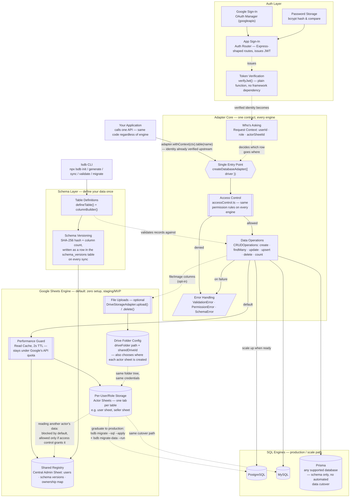

**How to read it, in one sentence:** every request carries *who's asking* (Request Context) through *one shared gate* (Access Control) before it ever touches storage, and storage itself can be the free/zero-setup Google Sheets path today and a production SQL database tomorrow — without the application layer changing at all.

**Known limitation worth stating in the report:** file uploads are Sheets-engine-only and don't move during a SQL cutover — `migrate-data --run` copies row data, not files sitting in Drive, so a table with an image/file column needs its own migration plan (e.g. re-pointing URLs at whatever object storage the production stack uses) alongside `migrate-data`.

The sections below (§1–§5) zoom into individual parts of this diagram in more implementation detail.

---

Five views, each isolating one part of the mechanism:

1. Engine selection and the shared contract
2. Sheets-engine module map
3. A `findMany()` call end-to-end, including the read cache
4. The actor storage model and cross-actor access
5. The CLI's own dependency surface

Five more views below (§6–§10) cover angles the above don't: the end-user login flow, the permission matrix in full, the staging→production cutover, physical deployment, and how `lsdb erdiagram` itself works.

---

## 1. Engine Selection & the Shared Contract

`createDatabaseAdapter({ driver })` (or `$DB_DRIVER`) is the only branch point in application code. Every engine below it implements the identical `DatabaseAdapter` / `TableOperations` interface and delegates cross-actor permission checks to the same `accessControl.ts` — that's what lets application CRUD code stay engine-agnostic.

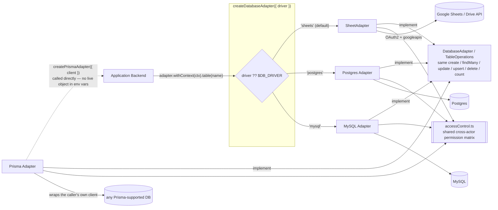

`pg` and `mysql2` are optional peer dependencies, lazily `require`'d only inside `createPostgresAdapter()` / `createMySQLAdapter()`, so importing this package never pulls either in for Sheets-only consumers. `'prisma'` isn't a `DBDriver` value — `createPrismaAdapter()` needs an already-constructed client, and no env var can hold a live object.

---

## 2. Sheets-Engine Module Map

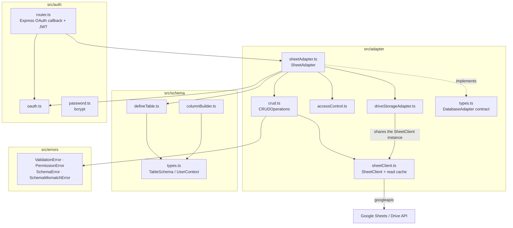

`accessControl.ts` was extracted verbatim from `SheetAdapter`'s former private `hasPermission()` so the SQL adapters enforce identical semantics instead of reimplementing the branching logic — `SQLAdapterBase` and `PrismaAdapterBase` both import the same two functions shown in diagram 1.

---

## 3. Request Flow: `findMany()` Through the Read Cache

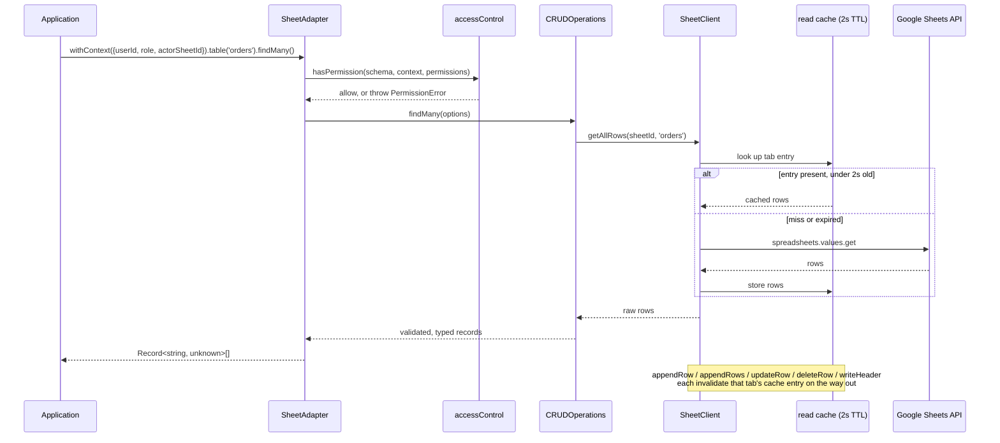

The cache exists to stay under Google's per-user Sheets API read quota — every read path is required to route through `getAllRows()`, and every write method must pair with `invalidateCache()`, or the system silently regresses to stale reads or a cache that never clears.

---

## 4. Actor-Based Storage Model

An **actor** decides *where* a row lives (which spreadsheet, which schemas) and is fixed at deploy time in `lsdb.config.ts` — it is not the same thing as an application RBAC role, which is dynamic and lives in the consumer's own `roles` table.

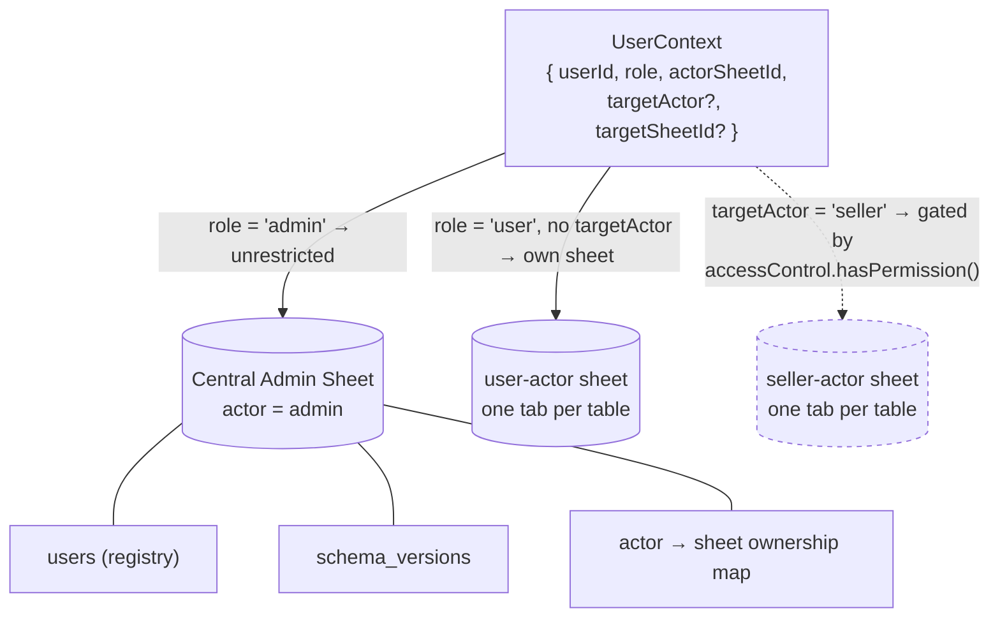

Dashed = conditional: cross-actor reads are blocked by default and only pass if the permission matrix grants them. `Docs/architecture.md` §4 lists the two supported patterns for legitimate cross-actor reads today (a shared admin table the admin context queries on the caller's behalf) — a first-class `adapter.join()` that runs concurrent per-sheet queries and joins in memory is still on the roadmap.

---

## 5. CLI Surface

The CLI only ever touches schema files and sheet/DB *structure* — never runtime row data outside `seed` / `mock-users` / `export*`.

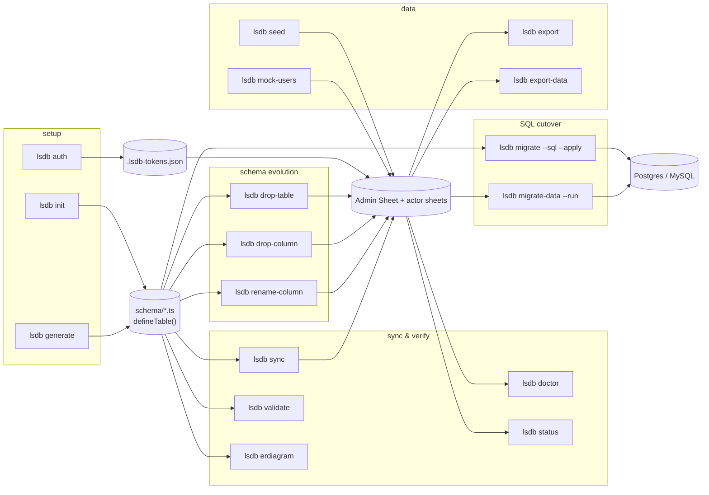

`migrate --sql` generates DDL from the same `TableSchema` definitions the Sheets engine validates against; `migrate-data --run` is the actual cutover, reading current sheet rows and writing them into the target Postgres/MySQL connection.

`lsdb auth` is optional, not a hard prerequisite the diagram implies by position — every other command that touches `Admin` (`sync`, `drop-table`, `drop-column`, `rename-column`) runs the identical OAuth handshake itself on first use if `.lsdb-tokens.json` isn't already there. Running `auth` explicitly just does that handshake as its own step, up front.

---

## 6. Login / OAuth Flow, End-to-End

The Auth Layer in the main diagram is two boxes; this is what actually happens on the wire when a user signs in, from `src/auth/router.ts` and `src/auth/oauth.ts`.

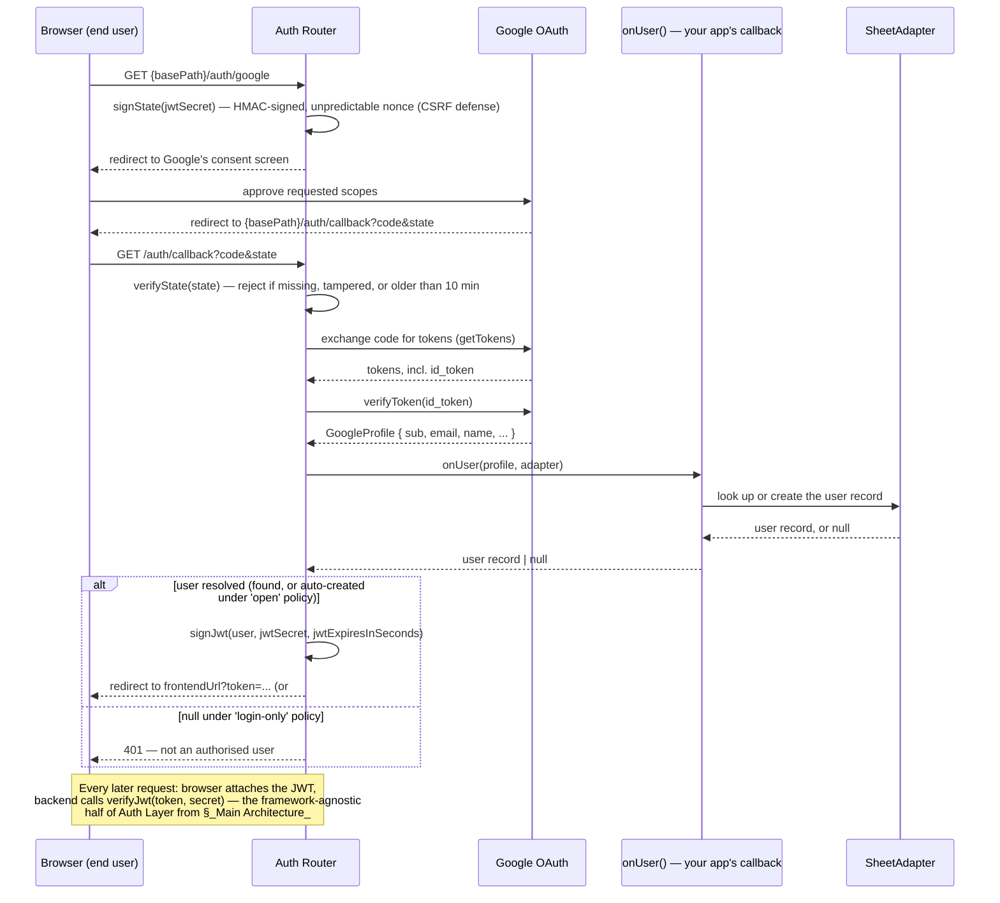

Two details worth calling out to a technical audience: the `state` parameter isn't a session lookup — it's self-contained and HMAC-signed, so the router needs no session store to be CSRF-safe. And `onUser()` is where *your* application's authorization policy lives — lsdb only proves the person is who Google says they are; whether that email is allowed into your app (`'open'` self-registration vs. `'login-only'` admin allowlist) is a callback you supply, not something lsdb decides for you.

---

## 7. Cross-Actor Permission Matrix

This is `accessControl.ts`'s `hasPermission()` spelled out as a table — the same rules the "Access Control" box in the main diagram enforces on every engine.

| Caller's role | Table's actor | `targetActor` set? | Result | Why |
|---|---|---|---|---|
| `admin` | any | — | ✅ Allowed | Admin is unrestricted — short-circuits every other check. |
| any non-admin | same as caller's own role | not set | ✅ Allowed | Reading/writing your own actor's data needs no special grant. |
| any non-admin | `admin` (e.g. `schema_versions`, the `users` registry) | any | ❌ Denied | Admin-actor tables are never reachable from a non-admin context, cross-actor or not. |
| non-admin | a different actor (e.g. `user` → `seller`) | set to that actor | ⚠️ Conditional | Allowed only if `permissions[role].canAccess` includes that actor **and**, if `permissions[role].tables` is set, the specific table is on that allowlist. |
| non-admin | a different actor, but caller's role has no entry in `permissions` at all | set | ❌ Denied (throws `PermissionError`) | "`'<role>' has no cross-actor permissions configured`" |

Once access is granted, `resolveNonAdminTenantKey()` decides *which* physical sheet (or tenant key, for SQL engines) the query actually runs against: same-actor requests use `context.actorSheetId`; a granted cross-actor request must supply `context.targetSheetId` or it throws — there's no implicit fallback that could accidentally point a cross-actor read at the wrong tenant.

> **Trust boundary — read this before citing the matrix as "secure."** `hasPermission()` performs *authorization* only: it trusts `context.role`/`context.actor` as already-true facts and never re-verifies who's making the claim. The `role === 'admin'` branch that grants unrestricted access is exactly as safe as whatever code built the `UserContext` object being passed in. That construction must happen in your application's own trusted server code, deriving `role` from a verified JWT (`verifyJwt()`, §6) plus a server-side lookup of the user's real role — never from client-controlled input (a query param, an unsigned cookie, a request body field). If application code ever did `role: req.query.role`, an attacker sending `?role=admin` would sail through this exact check, and `hasPermission()` would be behaving correctly given its inputs — the vulnerability would be one layer up, in how the context was built, not in this function.

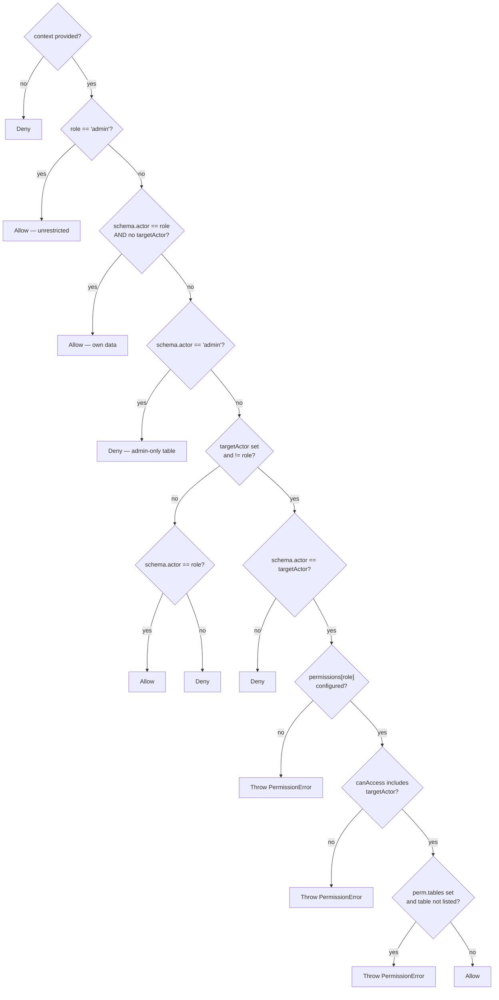

---

## 8. Staging → Production Cutover

Backs up the "Google Sheets as a staging database" narrative directly: staging isn't just "we happened to use Sheets" — it's a deliberate stage in a pipeline that ends in a real database, validated against the same schema definitions both times.

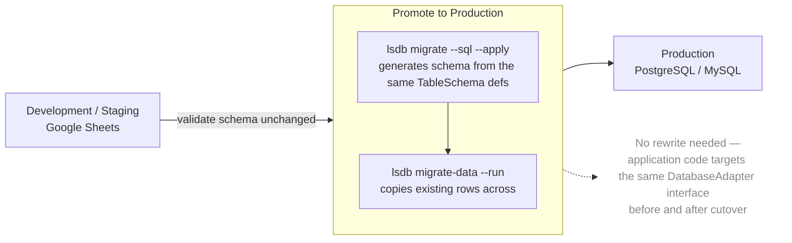

One gap to state plainly rather than let a reader assume it away: this cutover moves *row data*, not files — see the "Known limitation" note under the main diagram regarding Drive-hosted uploads.

---

## 9. Deployment / Physical Topology

Everything above is a *logical* view — modules and data flow. This is *where it actually runs*: three separate machines/services, and who's allowed to talk to whom.

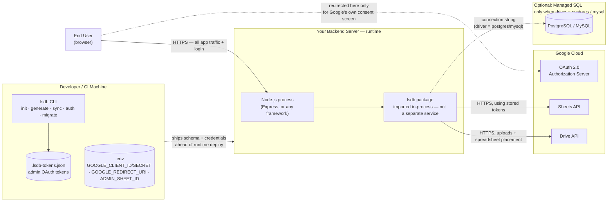

The point worth defending live: the browser never talks to Google Sheets, Drive, or the database directly — only to your backend. The one exception, being redirected to Google's own consent screen mid-login, is standard OAuth behavior, not a gap in that boundary.

---

## 10. How `lsdb erdiagram` Generates Its Output

Mechanically, in order, from `src/cli/commands/erdiagram.ts`:

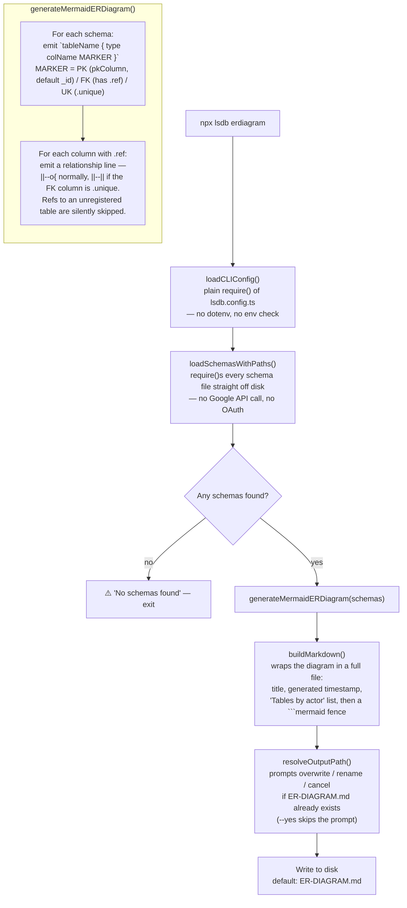

Two things worth knowing if you cite this as evidence of "schema-first" in the report: the ER diagram is derived *entirely* from your `defineTable()` calls — there's no separate diagramming step to keep in sync — and a foreign-key arrow only appears when `.ref('otherTable.column')` points at a table that's actually registered on the same adapter; a typo'd or not-yet-defined reference is dropped rather than crashing the command.

`erdiagram` is also the one CLI command that never touches Google at all — no `GOOGLE_CLIENT_ID`/`GOOGLE_CLIENT_SECRET`/`GOOGLE_REDIRECT_URI`, no OAuth handshake, no network call. Every other command that reaches `Admin` in §5 (`sync`, `drop-table`, `drop-column`, `rename-column`, `doctor`, `status`) goes through `buildAdminAdapter()`, which requires those three env vars and opens a live connection; `erdiagram` reads only your local schema files and prints what it finds.

---

## Cross-Cutting Concerns

- **One permission matrix, every engine.** `accessControl.ts`'s `hasPermission()` / `resolveNonAdminTenantKey()` are shared verbatim by `SheetAdapter`, `SQLAdapterBase`, and `PrismaAdapterBase` — a SQL engine has no physical per-user sheet, so `context.actorSheetId` / `targetSheetId` are reused as an opaque `tenant_id` column value instead.
- **Read cache correctness is a pairing, not a feature.** Any new read path must go through `SheetClient.getAllRows()`; any new write must call `invalidateCache()` for that tab.
- **Schema drift is versioned per actor sheet.** `SheetAdapter` writes a `schema_versions` row (hash + column count) into the admin sheet on every sync, and can detect/react to mismatches at runtime via `SchemaMismatchBehaviour`.
- **Custom errors carry the failure mode.** `ValidationError`, `PermissionError`, `SchemaError`, `SchemaMismatchError` — never a bare `Error` — so callers can branch on what actually went wrong.
